# T2A2 - Marketplace Project

DOCUMENTATION:

R7. Identification of the problem you are trying to solve by building this particular marketplace app.
R8. Why is it a problem that needs solving?
(R7 and R8 combined)

Since the COVID-19 pandemic began, restaurants have struggled financially due to a severe decrease in sit-down diners and walk-in takeaway customers due to enforced social-distancing and isolation rules. Food-delivery services were still available, however, the large-scale food-delivery corporations such as UberEats take a commission of up to 30%. This is a problem as it takes a large portion of profits away from the local businesses who are struggling the most.

'Speedy Feeds' is a food delivery service designed to:
- Supports local standalone food restaurants only (no chains)
- Customers/restaurants are capped at a 10km delivery radius within metropolitan Melbourne, to keep it local and to minimise the carbon footprint of delivery
- 'Speedy Feeds' takes a commission capped at a $2 service fee per order, so that restaurants and delivery drivers receive a much larger proportion of profit than with other delivery services - to aid local economic and business recovery post-pandemic lockdowns

R9. Heroku-deployed link:  https://speedy-feeds.herokuapp.com

R10. GitHub repo:   https://github.com/ejneyland/speedy_feeds_app

R11. Description of your marketplace app (website), including:
    - Purpose
      - For customers to be able to view restaurants in their local region and their accompanying menus, containing an item title, item description, a price and an image of the food.
      - For Restaurants to register their restaurant and display the food items they have on offer
      - For customers to make an order from restaurants, with selected food items and quantities 
      - For restaurants to receive orders made by customers, to be fulfilled and sent out for delivery 
    - Functionality / features
      - Users are able to create an account, sign-in and sign-out
      - Full CRUD operations for adding a Restaurant
      - Full CRUD operations for adding food items and assigning them to the Restaurants they belong to
      - Image upload to food items
      - Authorization of CRUD operations designated to authorized user roles, so that customer's are unable to create new restaurants or food items
      - Validation flash alerts and error messages accross sign-up, edit and create functions
    - Sitemap
    - Screenshots
    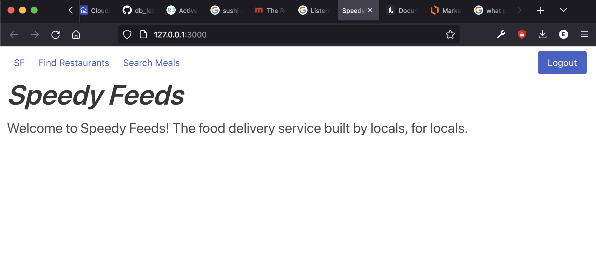
    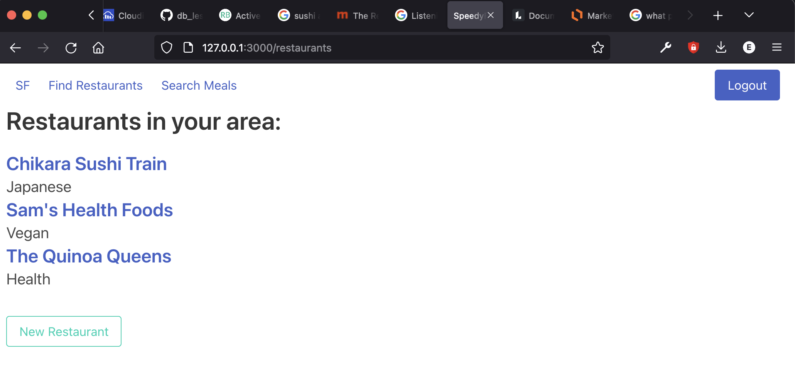
    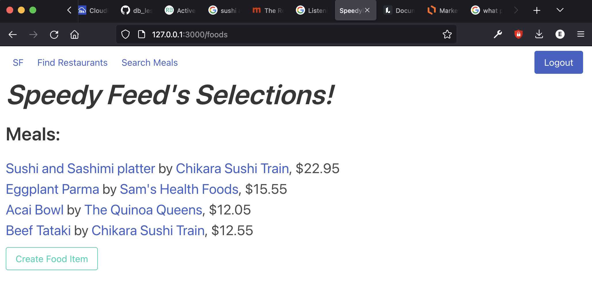
    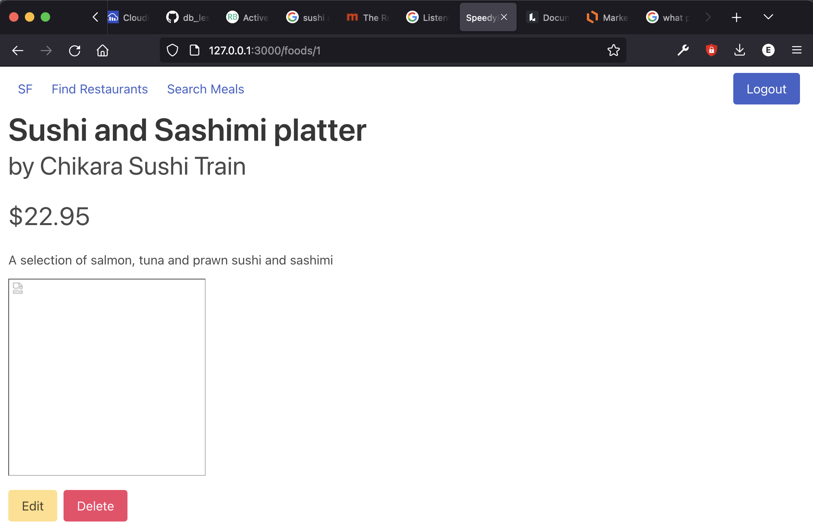
    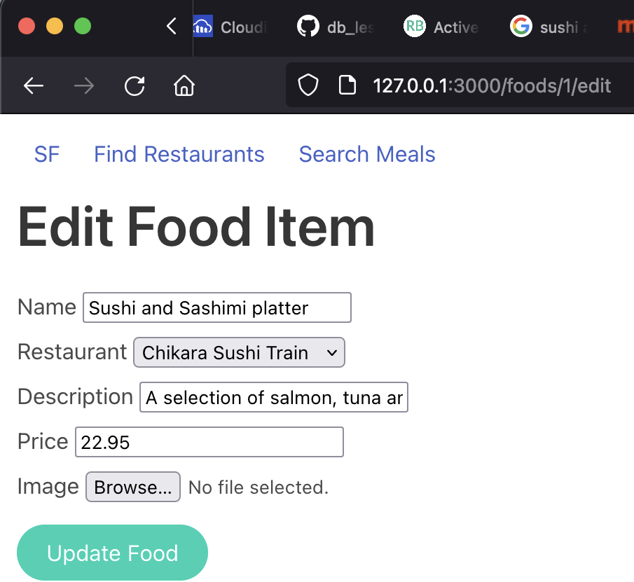
    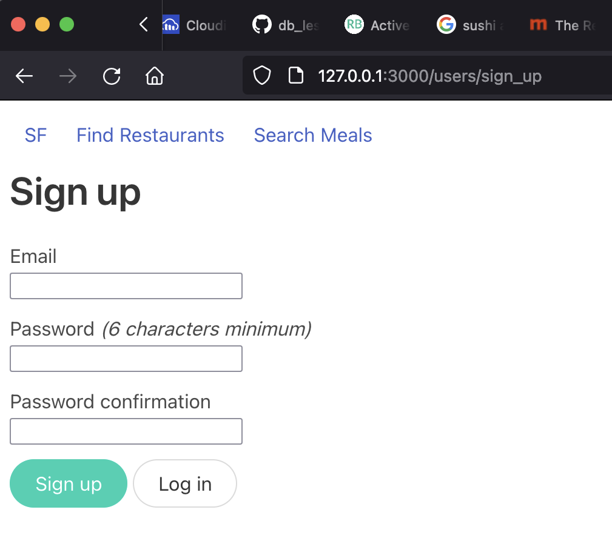
    - Target audience
      - Local restaurants
      - Local consumers
      - Delivery drivers
    - Tech stack (e.g. html, css, deployment platform, etc)
      - html, css, ruby, ruby on rails
      - CSS framework: // Bulma 
      - Database // SQLite
      - Authentication // Devise
      - Authorisation // Rolify, Pundit
      - Active Storage // Cloudinary
      - Deployment // Heroku    

R12. User Stories

User (on sign-up):
- User is able to sign up to the platform to create an account using a personal/business email and a chosen password
- User is able to select whether they are a restaurant or customer (default)

Customer:
- Customer is able to browse available restaurants in the area
- Customer is able to view a menu for each restaurant
- Customer is able to view and browse meals on the menu, displaying a title, description and price
- Customer is able to view an image of each menu item

Restaurant (vendor): 
- Vendor is able to sign up to the platform and register their restaurant with the app
- Vendor is able to register their restaurant's details: name and cuisine
- Vendor is able to add menu items to their shop, specifying a title, description and price
- Vendor is able to upload an image for each menu item

R13. Wireframes

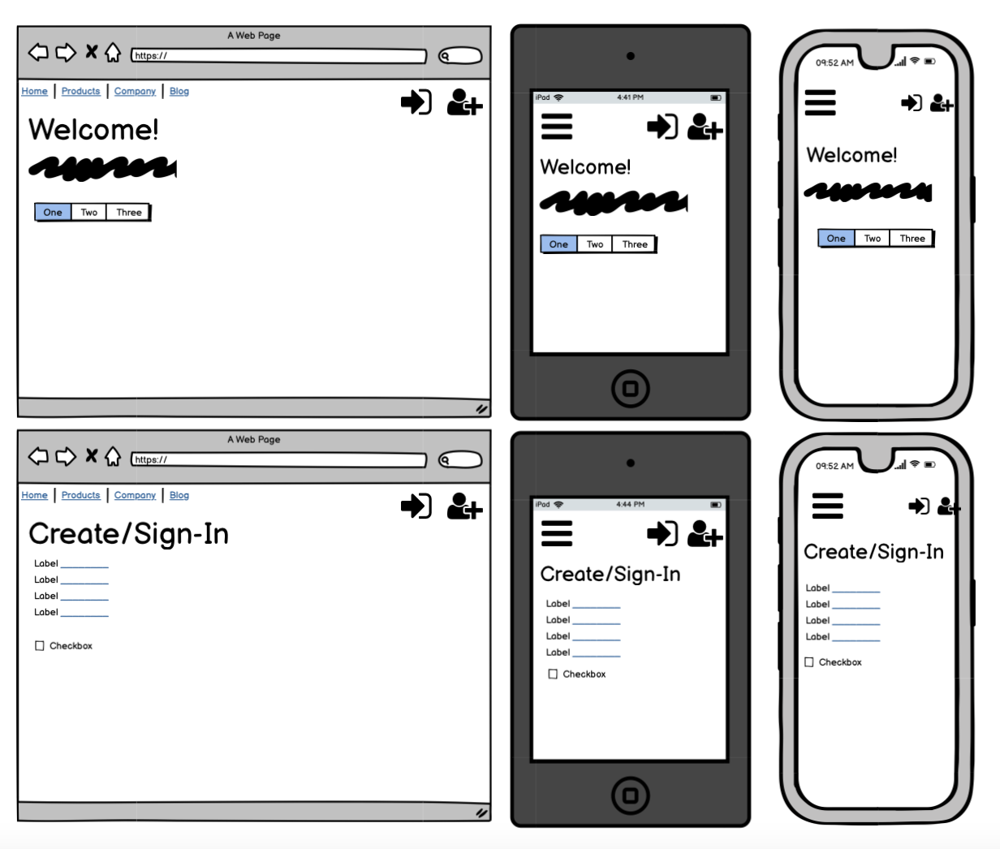

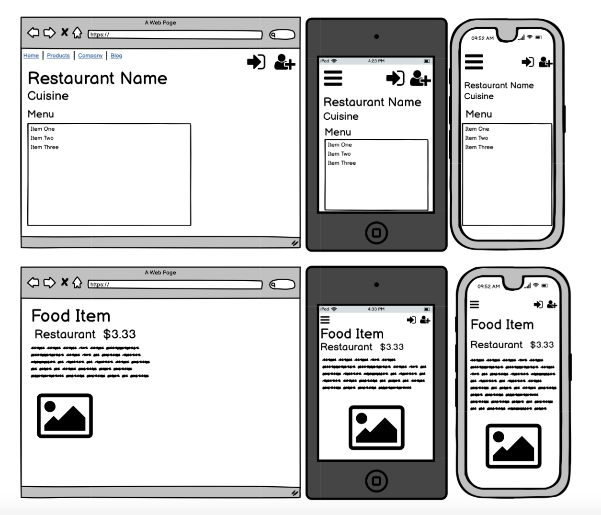

R14. LucidChart: ERD

Initial Entity Relationship Diagram

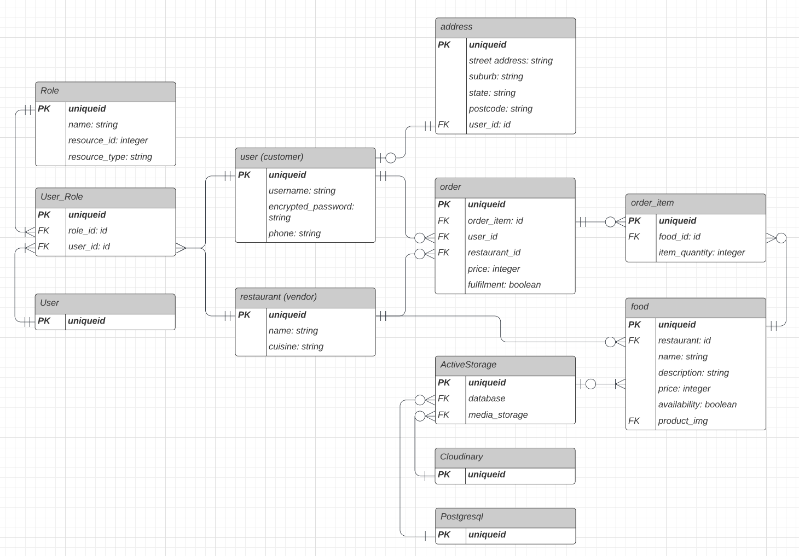

Final ERD showing which entities weren't implemented in the final product.

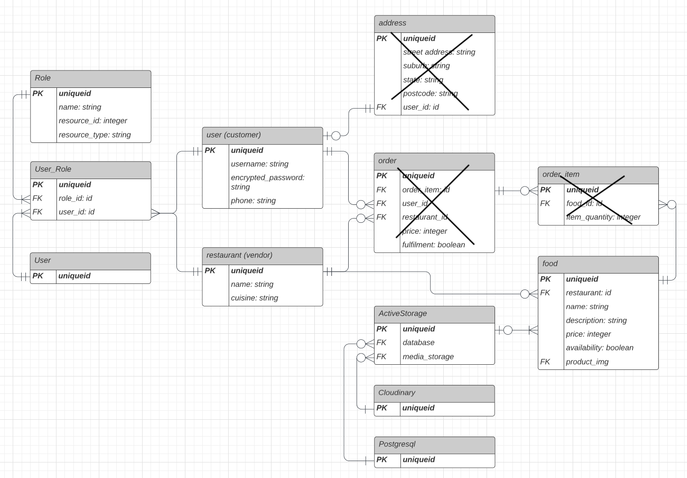

R15. Explain the different high-level components (abstractions) in your app
// Models & Entities
Foods: an entity of product/item, with params relating to its name, description, price and image. Food is an object of a menu (belonging to a restaurant) and an order (belonging to a customer and restaurant)
Restaurants: an entity of 
Users
Roles

R16. Detail any third party services that your app will use
- Cloudinary - active storage, image upload cloud service
- Heroku - deployment platform 

R17. Describe your projects models in terms of the relationships (active record associations) they have with each other

Food: belongs_to :restaurant
Food stores restaurant_id in its data table

Restaurant: has_many :foods

Role: has_and_belongs_to_many :users
User_id and role_id stored in a join table

R18. Discuss the database relations to be implemented in your application
R19. Provide your database schema design
(R18 and R19 combined)

Foods => restaurant_id
Foods are assigned a restaurant ID.
Food items are belonging to a restaurant
Restaurant has many food items

Roles => user_id
Roles are assigned to user's through a user ID
Roles are belonging to users
Users has one or many roles

R20. Describe the way tasks are allocated and tracked in your project

For this project I listed the tasks required for building my marketplace app, and implemented into a kanban task tracker using Trello. For each task I created a target completion date, a description detailing what is required and what the objective for each task was. Individual steps for each task were outlined on paper in my notebook, which were taken following the steps taken in class. This allowed me to refer back to each step taken if a problem was to arise.

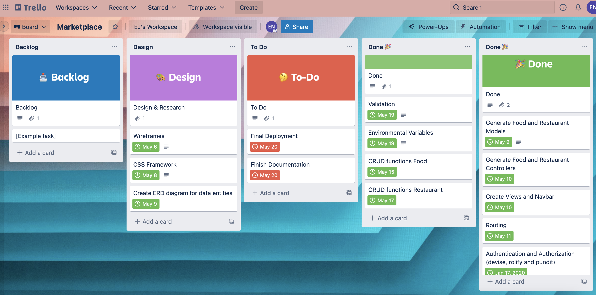

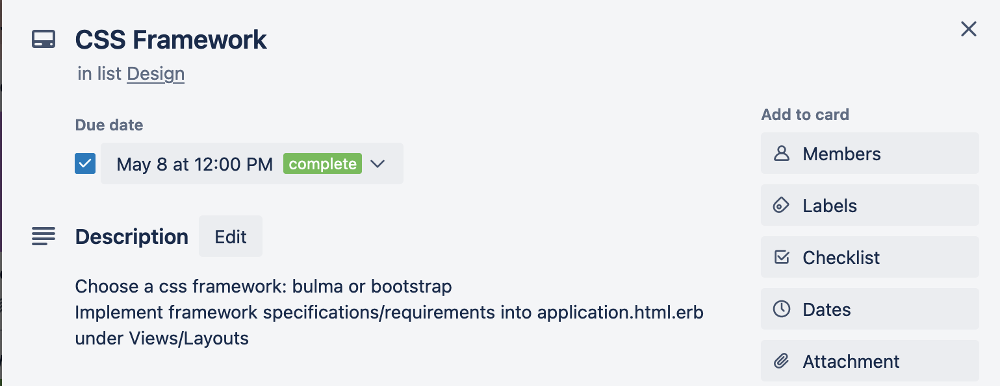

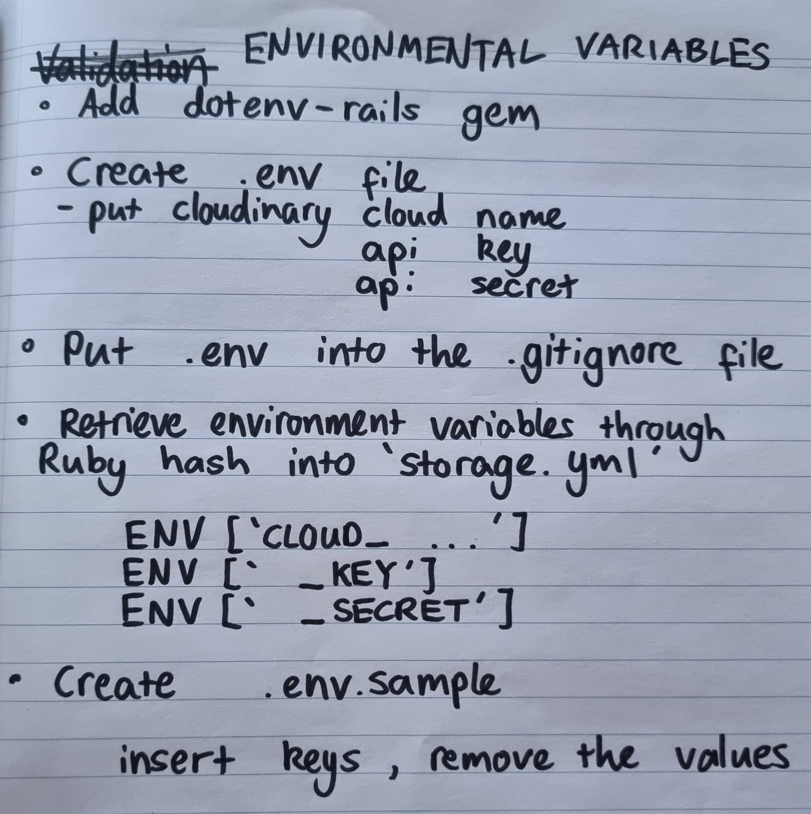

